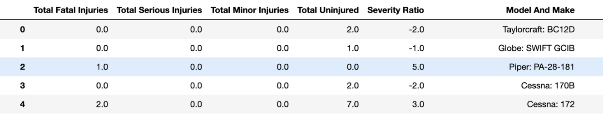
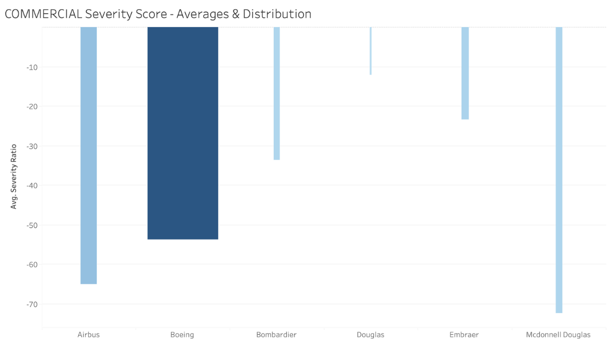
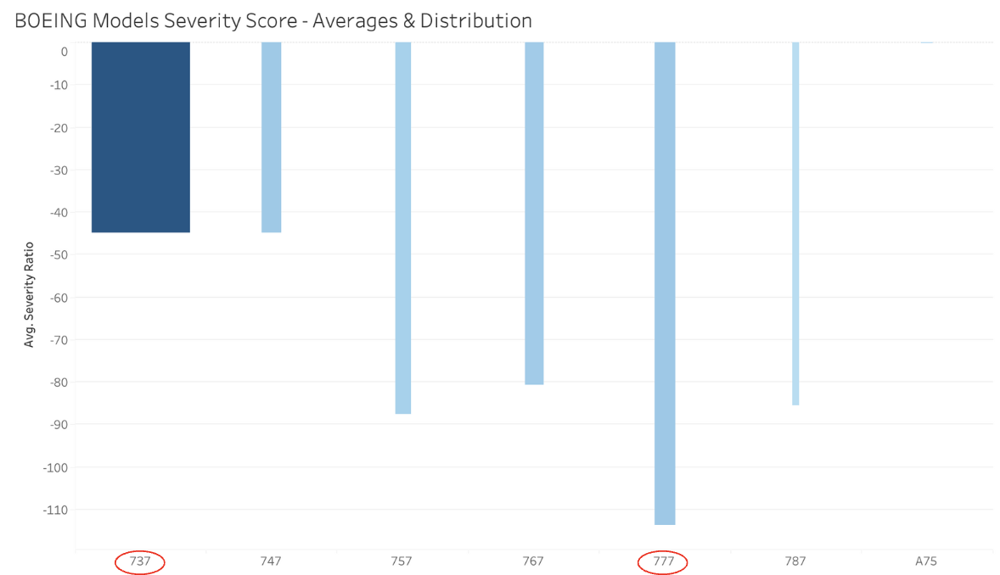
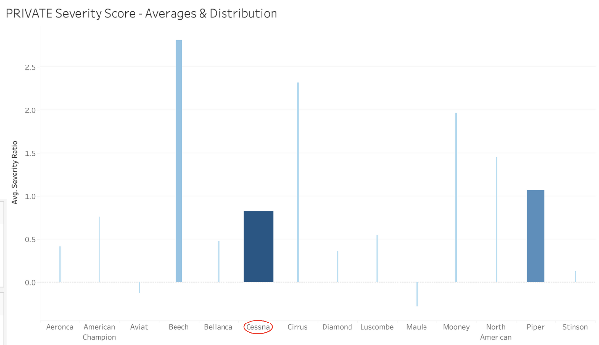
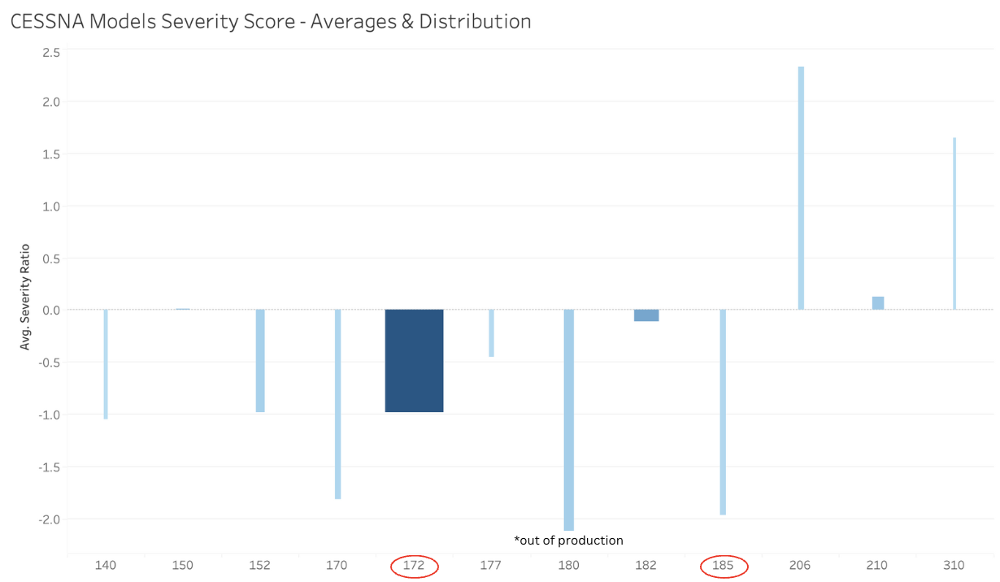

# Aircraft Risk Analysis

**Authors**: JF Roberts & Nick Tjandra


## Overview

Our company is expanding into new industries to diversify its portfolio. Specifically, our company is looking to invest in airplanes for both commercial and private use. This project analyses a data set of aviation accidents pulled from the National Transportation Safety Board to assess the risk factor of various aircraft makes and models. We will make recommendations of specific makes and models based on our risk analysis results.

## Business Understanding

Our company wants to invest in airplanes for both commercial and private use. To make the most accurate recommendations for both categories we will analyze the risk factor of all airplane makes and models, again for both commercial and private use separately. This will allow us to recommend the safest aircrafts to invest in as our company diversifies.

## The Data 

The data set we used for our analysis was pulled from the National Transportation Safety Board and includes over 85,000 civil aviation accidents from 1962 to 2023. It includes specific makes and models for every accident recorded.

## Key Statistics & Analysis

After thorough analysis and cleaning of the raw data, we developed a "Severity Score" to evaluate the overall risk of each aircraft make and model. We arrived at the "Severity Score" by aggregating the different injury severity categories and assigning different weights to each category based on injury severity.



## Recommendations - Commerical Use

The bar graphs below demonstrate: 
- The Average Severity Score (height of each bar) for each **commercial** airplane make (first bar graph) and each model of that make (second bar graph) as well as the corresponding sample size for each make and model, represented by the width of the bars. 
- The wider the bar the larger the sample of data points, and the larger the sample of data the more significant the Average Severity Score becomes. Based on these two variables we recommend investing in the Boeing 737 and 777 for commercial use.

 

  

## Recommendations - Private Use

The bar graphs below demonstrate: 
- The Average Severity Score (height of each bar) for each **private** airplane make (first bar graph) and each model of that make (second bar graph) as well as the corresponding sample size for each make and model, represented by the width of the bars. 
- The wider the bar the larger the sample of data points, and the larger the sample of data the more significant the Average Severity Score becomes. Based on these two variables we recommend investing in the Cessna 185 and 172 for private use.

 



## Conclusion

To conclude, we recommend the following four aircrafts for commercial and private use based on our risk analysis:

For commercial airplanes, we recommend the:
- **BOEING 737**
- **BOEING 777**

For private airplanes, we recommend the:
- **CESSNA 185**
- **CESSNA 172**

## Next Steps

- **Recommending specific engines for each model.** To get even more specific, we could repeat a similar analysis on engine types for each make and model that was recommended.
- **Cost Analysis.** To make our recommendations more comprehensive, we could perform a cost analysis of the different models and engine types.
- **Regional Analysis.** We would also recommend analyzing the lowest-risk regions of the country for these specific airplane models.

## Repository Structure

```
├── data
├── notebooks
├── images
├── README.md
├── LICENSE
└── Aircraft_Risk_Analysis_Presentation.pdf
```
